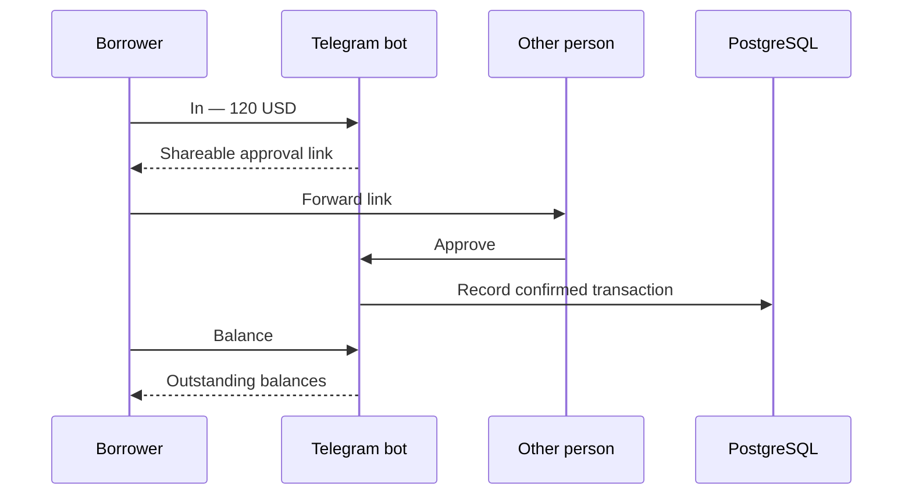

# Split a Bill

### A Telegram prototype for recording and confirming personal debts.

[](https://github.com/Duqamaqa/Split_a_bill/actions/workflows/tests.yml)

Record money you received, share an approval link with the other person, and view outstanding balances. The interaction centers on three actions: **In**, **Balance**, and **Close**.

**Python 3.12+ · aiogram 3 · FastAPI · PostgreSQL**

[User flow](BOT_FULL_DESCRIPTION.md) · [Architecture](docs/ARCHITECTURE.md) · [Deployment](docs/DEPLOYMENT.md) · [Validation](docs/VALIDATION.md)

## The flow



`Close` records closure of mutual balances with a selected person. It does not transfer money or prove that repayment happened outside the bot.

## Run locally

You need Python 3.12+, PostgreSQL 14+, and a Telegram bot token. Use a development bot and demonstration data when evaluating the project.

```bash
git clone https://github.com/Duqamaqa/Split_a_bill.git
cd Split_a_bill
python3 -m venv .venv
source .venv/bin/activate
pip install -r requirements.txt
cp .env.example .env
```

Set `BOT_TOKEN`, `BOT_USERNAME`, and `DATABASE_URL` in `.env`. `DEFAULT_CURRENCY` defaults to `ILS`. Keep credentials out of commits and screenshots.

Create the database schema using [postgres/schema.sql](postgres/schema.sql). The checked-in migration is for existing databases that need the payment-request tables; review your database state before applying it.

Start polling:

```bash
python -m bot.main
```

For hosted webhook operation, follow [docs/DEPLOYMENT.md](docs/DEPLOYMENT.md). **The Cloudflare Python Worker scaffold does not support this application's current direct PostgreSQL connection as-is.**

## Inspect the implementation

| Concern | Source |
| --- | --- |
| User actions and amount parsing | [bot/handlers/simple.py](bot/handlers/simple.py) |
| Database operations and Decimal amounts | [bot/db.py](bot/db.py) |
| Schema and migration | [postgres](postgres) |
| Webhook and health routes | [bot/webhook_app.py](bot/webhook_app.py) |
| Environment settings | [bot/config.py](bot/config.py) |
| Duplicate-update handling | [bot/middlewares/idempotency.py](bot/middlewares/idempotency.py) |

## Run the tests

With the dependencies installed:

```bash
python -m unittest discover -s tests -v
```

The existing ten tests cover amount parsing, balance labels, configuration, and webhook-secret matching. They do not require a real Telegram token or PostgreSQL connection. See the [validation record](docs/VALIDATION.md) and [CI workflow](.github/workflows/tests.yml).

## Status and limitations

An AI-assisted portfolio prototype, developed with extensive AI assistance and not currently in active personal use. No maintained public bot endpoint or production service is promised.

- This tracks records of debts; it does not move money or integrate a payment processor.
- Webhook-secret validation is optional in the current implementation. **Set a strong `WEBHOOK_SECRET` for any hosted webhook deployment.**
- Duplicate-update tracking is not proof of exactly-once processing under concurrent delivery.
- The existing tests do not cover database transactions, concurrent approvals, or a live Telegram conversation.
- Python dependencies use version ranges; a future installation can resolve different versions.

These boundaries are part of the project, not claims hidden behind a passing test badge. Read the [architecture](docs/ARCHITECTURE.md) before adapting the prototype for real users.
